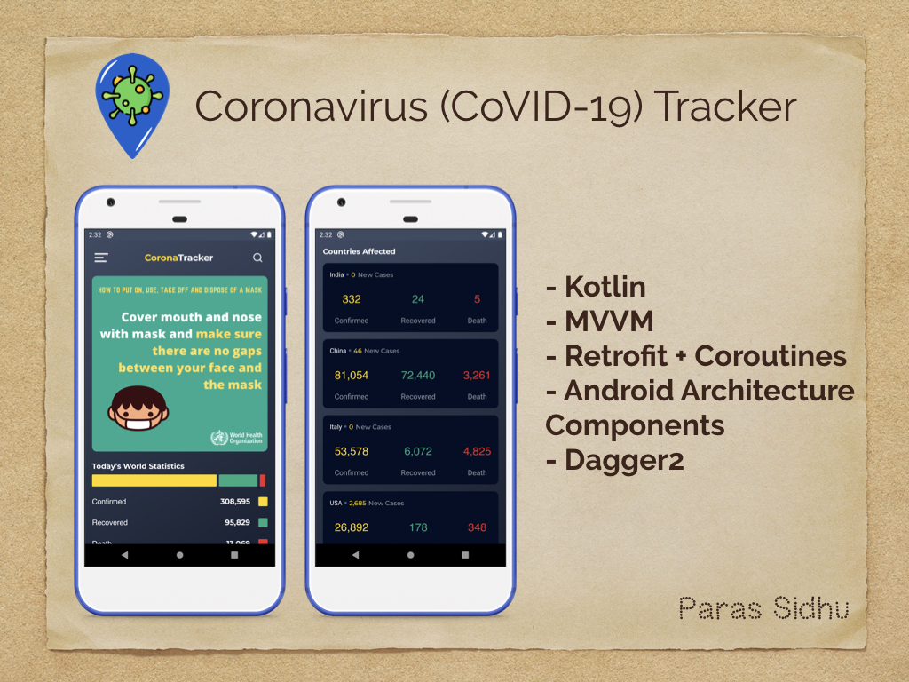

# Introduction   
Corona Tracker is an Android application which shows worldwide data of confirmed cases, recovered cases and death cases. You can also get country-wise data. The data is provided by <a href="https://rapidapi.com/user/astsiatsko">astsiatsko</a>.

## New Features
- Offline caching using Room persistance library (injected with Dagger2)
- Ability to pin specific countries (also using Room)
- Statewise data of Indian States (with sorting options)
- Connected banners with Firebase Remote Config which changes every few seconds

### **Star :star:  this repo to show your support and it really does matter!** :clap:

Corona Tracker is written in Kotlin and makes use of KTX, Coroutines, Dagger2, Retrofit and MVVM. If you find code issues, feel free to create a new issue or make a PR.

# Getting Started

1. To get started, you will need the API key which you can obtain from <a href="https://rapidapi.com/astsiatsko/api/coronavirus-monitor/endpoints">here</a>.

2. Put this key in Constants.kt file.
3. Connect the app with Firebase.
4. That's it! You're good to go :)

You can download the apk <a href="app-release.apk">here</a>.

# Credits

Corona Tracker has been developed by me (Paras Sidhu) with the purpose that society remains informed about the corona cases and can get helpful tips from WHO which are shown in main banner.

To make it better on the developer end, I tried using best practices as mentioned above.

Special thanks to the guys at https://www.covid19india.org and their volunteers for providing state-wise data.

UI/UX Design is provided by <a href="https://www.linkedin.com/in/pratik-kohli-a1921089/">Pratik Kohli</a>.
